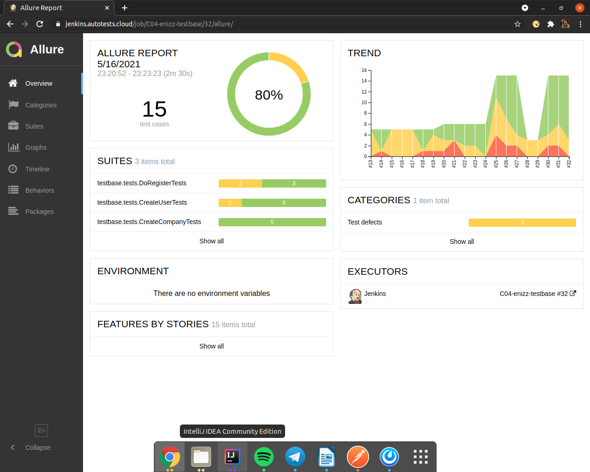

  

## Testbase tests 
:robot:

[**Documentation**](https://testbase.atlassian.net/wiki/spaces/USERS/pages/592511089/SOAP+REST)

- [X] - [doRegister](https://github.com/dandreyanov/TestBase/blob/master/src/test/java/testbase/tests/DoRegisterTests.java)
- [X] - [CreateCompany](https://github.com/dandreyanov/TestBase/blob/master/src/test/java/testbase/tests/CreateCompanyTests.java)
- [X] - [CreateUser](https://github.com/dandreyanov/TestBase/blob/master/src/test/java/testbase/tests/CreateUserTests.java)
    
[**Jenkins**](https://jenkins.autotests.cloud/job/C04-enizz-testbase/)

[**Allure Report**](https://jenkins.autotests.cloud/job/C04-enizz-testbase/26/allure/)
    